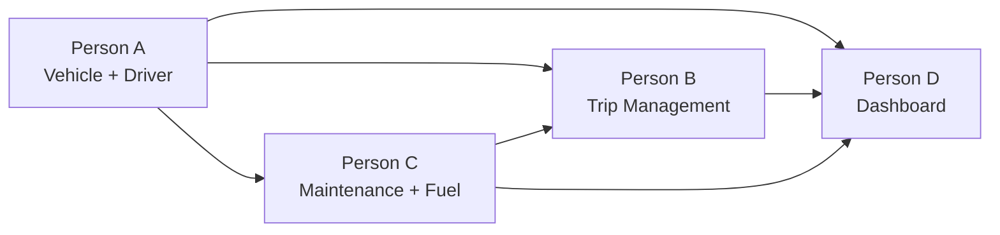

# TransitOps — Hackathon Implementation Plan (Odoo 18)

## Overview

Build a native **Odoo 18 module** (`transit_ops`) for transport operations management — vehicles, drivers, trips, maintenance, fuel, expenses, RBAC, and KPI dashboard.

| Decision | Choice |
|----------|--------|
| **Framework** | Odoo 18 Community Edition |
| **Infrastructure** | Docker Compose (Odoo + PostgreSQL) |
| **Backend** | Python 3.11+ / Odoo ORM |
| **Frontend** | OWL + QWeb XML (default Odoo UI) |
| **Export** | Both CSV and PDF (QWeb reports + wkhtmltopdf) |
| **Git** | Team manages their own workflow |

---

## Phase 0 — Project Init (Done by Agent, Before Hackathon)

I will prepare the **shared foundation** so all 4 team members can clone, `docker compose up`, and start working immediately on their track.

### What I Set Up

| File / Directory | Purpose |
|-----------------|---------|
| `docker-compose.yml` | Odoo 18 + PostgreSQL containers, custom addons volume mount |
| `odoo.conf` | Odoo config pointing to `./addons` |
| `addons/transit_ops/__manifest__.py` | Module metadata, dependencies, file registry |
| `addons/transit_ops/__init__.py` | Root package init importing `models`, `controllers` |
| `addons/transit_ops/models/__init__.py` | Imports all model files (initially empty stubs) |
| `addons/transit_ops/controllers/__init__.py` | Imports controller files |
| `addons/transit_ops/views/` | Empty directory for XML views |
| `addons/transit_ops/security/` | Empty directory for ACLs and groups |
| `addons/transit_ops/data/` | Empty directory for demo data |
| `addons/transit_ops/reports/` | Empty directory for QWeb reports |
| `addons/transit_ops/wizard/` | Empty directory for export wizards |
| `addons/transit_ops/static/src/{js,xml,css}/` | Empty directories for OWL assets |
| `README.md` | Setup instructions + quick reference |

### Module Scaffold Structure

```
odoo-hackathon-2026/
├── docker-compose.yml
├── odoo.conf
├── README.md
└── addons/
    └── transit_ops/
        ├── __init__.py
        ├── __manifest__.py
        ├── models/
        │   ├── __init__.py
        │   ├── transit_vehicle.py       ← Person A
        │   ├── transit_driver.py        ← Person A
        │   ├── transit_trip.py          ← Person B
        │   ├── transit_maintenance.py   ← Person C
        │   ├── transit_fuel_log.py      ← Person C
        │   └── transit_expense.py       ← Person C
        ├── views/
        │   ├── vehicle_views.xml        ← Person A
        │   ├── driver_views.xml         ← Person A
        │   ├── trip_views.xml           ← Person B
        │   ├── maintenance_views.xml    ← Person C
        │   ├── fuel_log_views.xml       ← Person C
        │   ├── expense_views.xml        ← Person C
        │   ├── menu_views.xml           ← Person D
        │   └── dashboard_views.xml      ← Person D
        ├── security/
        │   ├── security.xml             ← Person D
        │   └── ir.model.access.csv      ← Person D
        ├── controllers/
        │   ├── __init__.py
        │   └── dashboard.py             ← Person D
        ├── data/
        │   └── demo_data.xml            ← Person C
        ├── reports/
        │   ├── report_templates.xml     ← Person A
        │   └── report_actions.xml       ← Person A
        ├── wizard/
        │   ├── __init__.py
        │   └── report_wizard.py         ← Person A
        └── static/
            └── src/
                ├── js/
                │   └── dashboard.js     ← Person D
                ├── xml/
                │   └── dashboard.xml    ← Person D
                └── css/
                    └── dashboard.css    ← Person D
```

> [!TIP]
> Each model file and view file will be created as a **minimal stub** (empty class / empty XML record) so that `__manifest__.py` and `__init__.py` reference everything from the start. This prevents import errors when one person's code depends on another's model existing.

### How Team Members Start

```bash
# 1. Clone the repo
git clone <repo-url>
cd odoo-hackathon-2026

# 2. Start Odoo + PostgreSQL
docker compose up -d

# 3. Open browser
# → http://localhost:8069
# → Create database, install transit_ops module

# 4. Start coding your track!
# After editing Python files:  docker compose restart odoo
# After editing XML files:     Upgrade module from Odoo Apps menu (or restart)
```

---

## Phase 1 — Four Task Tracks (Self-Select)

Each person picks **one track**. Tracks are designed to be **independent for the first 5 hours**, with integration in the final hours.

### Dependencies Between Tracks



> [!IMPORTANT]
> **Person A should commit first** (within ~2 hours) because Vehicles & Drivers are referenced by Trips (B), Maintenance/Fuel (C), and Dashboard (D). The stubs I create in Phase 0 will have the model `_name` and basic fields so others can start immediately, but Person A fills in the full implementation.

---

### 🅰️ Person A — Vehicle Registry + Driver Management + Reports

**Difficulty:** ⭐⭐ Medium  
**Files owned:** `transit_vehicle.py`, `transit_driver.py`, `vehicle_views.xml`, `driver_views.xml`, `report_templates.xml`, `report_actions.xml`, `report_wizard.py`

#### Hour 1–2.5: Vehicle & Driver Models

**`models/transit_vehicle.py`** — `transit.vehicle`

| Field | Type | Notes |
|-------|------|-------|
| `registration_number` | `Char` | Required, unique (`_sql_constraints`) |
| `name` | `Char` | Vehicle name/model, required |
| `vehicle_type` | `Selection` | Truck / Van / Sedan / Bus / Other |
| `max_load_capacity` | `Float` | In kg |
| `odometer` | `Float` | Current reading in km |
| `acquisition_cost` | `Float` | Purchase price |
| `status` | `Selection` | `available` / `on_trip` / `in_shop` / `retired` |
| `region` | `Char` | For dashboard filtering |
| `trip_ids` | `One2many` | Reverse link to trips |
| `maintenance_ids` | `One2many` | Reverse link to maintenance logs |
| `fuel_log_ids` | `One2many` | Reverse link to fuel logs |
| `expense_ids` | `One2many` | Reverse link to expenses |
| `total_fuel_cost` | `Float` | Computed: sum of fuel log costs |
| `total_maintenance_cost` | `Float` | Computed: sum of maintenance costs |
| `total_operational_cost` | `Float` | Computed: fuel + maintenance |
| `vehicle_roi` | `Float` | Computed: `(Revenue - (Maintenance + Fuel)) / Acquisition Cost` |

Key implementation:
- `_sql_constraints = [('registration_unique', 'unique(registration_number)', 'Registration number must be unique!')]`
- Computed fields use `@api.depends` on related `fuel_log_ids.cost` and `maintenance_ids.cost`

**`models/transit_driver.py`** — `transit.driver`

| Field | Type | Notes |
|-------|------|-------|
| `name` | `Char` | Required |
| `license_number` | `Char` | Required |
| `license_category` | `Selection` | A / B / C / D / E |
| `license_expiry` | `Date` | |
| `contact_number` | `Char` | |
| `safety_score` | `Float` | 0–100 scale |
| `status` | `Selection` | `available` / `on_trip` / `off_duty` / `suspended` |
| `is_license_expired` | `Boolean` | Computed: `license_expiry < today` |
| `trip_ids` | `One2many` | Reverse link to trips |

#### Hour 2.5–4.5: Vehicle & Driver Views

**`views/vehicle_views.xml`**
- **Form view:** Status bar widget for `status`, smart buttons showing trip count and maintenance count, fields grouped logically (Identity, Capacity, Financials)
- **Tree view:** Key columns with optional_show/hide, color-coded by status
- **Search view:** Filters for status (Available, On Trip, In Shop, Retired), group-by vehicle type and region

**`views/driver_views.xml`**
- **Form view:** Banner warning when `is_license_expired` is True, status bar, safety score progress bar
- **Tree view:** With license expiry highlighting
- **Search view:** Filters for status, expired licenses, group-by license category

#### Hour 4.5–6.5: Reports & Export

**`reports/report_templates.xml`**
- QWeb PDF template for fleet summary report
- QWeb PDF template for operational cost per vehicle

**`reports/report_actions.xml`**
- `ir.actions.report` records linking templates to models

**`wizard/report_wizard.py`** + wizard view XML
- Transient model with `date_from`, `date_to`, `export_type` (CSV/PDF) fields
- `action_export_csv()`: Generate CSV using `io.BytesIO` + `csv.writer`, return as `base64` attachment download
- `action_export_pdf()`: Trigger QWeb report generation

#### Hour 6.5–8: Polish
- Add attachment widget to vehicle form (vehicle document management — bonus)
- Enhanced search, filters, sorting
- Help Person B/C with integration issues

---

### 🅱️ Person B — Trip Management + Business Rules

**Difficulty:** ⭐⭐⭐ Hard (most complex track)  
**Files owned:** `transit_trip.py`, `trip_views.xml`

#### Hour 1–3.5: Trip Model & All Business Rules

**`models/transit_trip.py`** — `transit.trip`

| Field | Type | Notes |
|-------|------|-------|
| `name` | `Char` | Auto-generated sequence (e.g., `TRIP/001`) |
| `source` | `Char` | Origin location |
| `destination` | `Char` | Destination location |
| `vehicle_id` | `Many2one` | → `transit.vehicle` |
| `driver_id` | `Many2one` | → `transit.driver` |
| `cargo_weight` | `Float` | In kg |
| `planned_distance` | `Float` | In km |
| `actual_distance` | `Float` | Filled on completion |
| `fuel_consumed` | `Float` | Filled on completion |
| `final_odometer` | `Float` | Filled on completion |
| `state` | `Selection` | `draft` / `dispatched` / `completed` / `cancelled` |
| `fuel_efficiency` | `Float` | Computed: `actual_distance / fuel_consumed` |

**Business rules to implement (all 10 mandatory rules):**

| # | Rule | How |
|---|------|-----|
| 1 | Retired/In Shop vehicles hidden from dispatch | `domain` attribute on `vehicle_id` field: `[('status', '=', 'available')]` |
| 2 | Expired/Suspended drivers blocked | `domain` on `driver_id`: `[('status', '=', 'available'), ('is_license_expired', '=', False)]` |
| 3 | On Trip vehicle can't be re-assigned | Domain already handles this (status != available). Also add `@api.constrains` as safety net |
| 4 | On Trip driver can't be re-assigned | Same as above |
| 5 | Cargo ≤ max capacity | `@api.constrains('cargo_weight', 'vehicle_id')` — raise `ValidationError` if exceeded |
| 6 | Dispatch → vehicle+driver → On Trip | `action_dispatch()` method: write vehicle.status = 'on_trip', driver.status = 'on_trip', self.state = 'dispatched' |
| 7 | Complete → vehicle+driver → Available | `action_complete()`: write vehicle.status = 'available', driver.status = 'available', update odometer, self.state = 'completed' |
| 8 | Cancel → vehicle+driver → Available | `action_cancel()`: restore both to 'available', self.state = 'cancelled' |
| 9 | *(Maintenance open → In Shop)* | Handled by Person C, but Person B must ensure `domain` filters respect it |
| 10 | *(Maintenance close → Available)* | Handled by Person C |

**Auto-sequence for trip names:**
- Use `ir.sequence` defined in a data XML file
- Override `create()` to assign sequence number

#### Hour 3.5–5.5: Trip Views & Kanban

**`views/trip_views.xml`**
- **Form view:**
  - Header with state-transition buttons: `Dispatch` (visible in draft), `Complete` (visible in dispatched), `Cancel` (visible in draft/dispatched)
  - Status bar widget showing `draft → dispatched → completed`
  - `vehicle_id` field with domain filter (only Available vehicles)
  - `driver_id` field with domain filter (only Available, non-expired drivers)
  - Completion section (actual distance, fuel consumed, final odometer) — only visible/editable in dispatched state
- **Tree view:** Color-coded by state (green=completed, orange=dispatched, grey=cancelled)
- **Kanban view:** Grouped by state for a visual dispatch board
- **Search view:** Filters by state, group-by vehicle/driver

**Trip sequence data:**
- `data/trip_sequence.xml` — defines `ir.sequence` for `TRIP/XXXX`

#### Hour 5.5–7: Integration Testing

Test the **exact workflow from Section 5** of the problem statement:
1. Vehicle 'Van-05' (500 kg) → Available ✓
2. Driver 'Alex' (valid license) → Available ✓
3. Create trip (450 kg cargo) → System validates 450 ≤ 500 ✓
4. Dispatch → Vehicle + Driver → On Trip ✓
5. Complete trip (enter final odometer + fuel) → Both → Available ✓
6. Create maintenance record → Vehicle → In Shop → Hidden from dispatch ✓
7. Dashboard KPIs update ✓

Test **edge cases:**
- Try cargo = 600 kg on 500 kg vehicle → Expect `ValidationError`
- Try assigning expired-license driver → Expect blocked
- Try double-booking an On Trip vehicle → Expect blocked
- Cancel a dispatched trip → Expect both restored to Available

#### Hour 7–8: Bug Fixes + Cross-Team Integration
- Fix issues from testing
- Coordinate with Person C on maintenance status transitions
- Coordinate with Person D on trip data for dashboard

---

### 🅲 Person C — Maintenance + Fuel Logs + Expenses + Demo Data

**Difficulty:** ⭐⭐ Medium  
**Files owned:** `transit_maintenance.py`, `transit_fuel_log.py`, `transit_expense.py`, `maintenance_views.xml`, `fuel_log_views.xml`, `expense_views.xml`, `demo_data.xml`

#### Hour 1–2.5: Maintenance Model

**`models/transit_maintenance.py`** — `transit.maintenance`

| Field | Type | Notes |
|-------|------|-------|
| `name` | `Char` | Description (e.g., "Oil Change") |
| `vehicle_id` | `Many2one` | → `transit.vehicle`, required |
| `maintenance_type` | `Selection` | Preventive / Corrective / Emergency |
| `description` | `Text` | Details |
| `date_start` | `Date` | When maintenance began |
| `date_end` | `Date` | When maintenance completed |
| `cost` | `Float` | Cost of maintenance |
| `state` | `Selection` | `open` / `done` |

**Status transition methods:**
- `action_open()`:
  - Set `self.state = 'open'`
  - Set `self.vehicle_id.status = 'in_shop'`
  - Vehicle now hidden from trip dispatch (Person B's domain filter handles this)
- `action_close()`:
  - Set `self.state = 'done'`
  - Set `self.vehicle_id.status = 'available'` **only if** vehicle is not `retired`

#### Hour 2.5–4: Fuel Log & Expense Models

**`models/transit_fuel_log.py`** — `transit.fuel.log`

| Field | Type | Notes |
|-------|------|-------|
| `vehicle_id` | `Many2one` | → `transit.vehicle`, required |
| `trip_id` | `Many2one` | → `transit.trip`, optional |
| `date` | `Date` | |
| `liters` | `Float` | Fuel quantity |
| `cost` | `Float` | Total fuel cost |
| `odometer_reading` | `Float` | Odometer at fill-up |

**`models/transit_expense.py`** — `transit.expense`

| Field | Type | Notes |
|-------|------|-------|
| `vehicle_id` | `Many2one` | → `transit.vehicle`, optional |
| `trip_id` | `Many2one` | → `transit.trip`, optional |
| `expense_type` | `Selection` | Toll / Maintenance / Other |
| `amount` | `Float` | |
| `date` | `Date` | |
| `description` | `Char` | |

#### Hour 4–5.5: All Three Views

**`views/maintenance_views.xml`**
- Form view with state buttons (Open → Done)
- Tree view sorted by date, filterable by state

**`views/fuel_log_views.xml`**
- Form view
- Tree view with group-by vehicle, totals at bottom (using `sum` attribute)

**`views/expense_views.xml`**
- Form view
- Tree view with group-by expense type, totals

#### Hour 5.5–7: Demo Data

**`data/demo_data.xml`** — Create realistic sample data for the demo:

| Entity | Records | Examples |
|--------|---------|---------|
| Vehicles | 5 | Van-05 (500kg), Truck-12 (5000kg), Sedan-03 (300kg), Bus-07 (2000kg), Van-11 (800kg) |
| Drivers | 4 | Alex (valid), Sarah (valid), Mike (expired license), Kim (suspended) |
| Trips | 4 | 1 completed, 1 dispatched, 1 draft, 1 cancelled |
| Maintenance | 2 | 1 open (vehicle in shop), 1 done |
| Fuel Logs | 5 | Linked to completed trips and vehicles |
| Expenses | 4 | Mix of toll, maintenance, other |

> [!TIP]
> Demo data makes the hackathon demo impressive — judges see a populated system, not empty screens. Also makes Person D's dashboard look great with real numbers.

#### Hour 7–8: End-to-End Testing
- Run through the full workflow
- Verify that Maintenance open → vehicle goes to In Shop
- Verify Maintenance close → vehicle returns to Available
- Verify computed fields on Vehicle (total_fuel_cost, total_maintenance_cost, total_operational_cost) calculate correctly
- Help with final integration

---

### 🅳 Person D — Security (RBAC) + Menu Structure + Dashboard

**Difficulty:** ⭐⭐⭐ Hard (requires OWL/JS knowledge)  
**Files owned:** `security/security.xml`, `security/ir.model.access.csv`, `menu_views.xml`, `dashboard_views.xml`, `controllers/dashboard.py`, `static/src/js/dashboard.js`, `static/src/xml/dashboard.xml`, `static/src/css/dashboard.css`

#### Hour 1–2.5: Security Groups & ACLs

**`security/security.xml`** — Define the 4 roles

```
Module Category: TransitOps

Group hierarchy (implied_ids):
  group_driver          (base level)
  group_safety_officer  (inherits group_driver)
  group_financial_analyst (inherits group_driver)
  group_fleet_manager   (inherits all three above — full access)
```

**`security/ir.model.access.csv`** — ACL matrix

| Model | Fleet Manager | Driver | Safety Officer | Financial Analyst |
|-------|:---:|:---:|:---:|:---:|
| `transit.vehicle` | CRUD | R | R | R |
| `transit.driver` | CRUD | R | RU | R |
| `transit.trip` | CRUD | CRU | R | R |
| `transit.maintenance` | CRUD | R | R | R |
| `transit.fuel.log` | CRUD | R | R | CRUD |
| `transit.expense` | CRUD | — | — | CRUD |

*(C=Create, R=Read, U=Update, D=Delete)*

#### Hour 2.5–3.5: Menu Structure

**`views/menu_views.xml`** — Complete navigation tree

```
📦 TransitOps (root menu)
├── 📊 Dashboard
├── 🚛 Fleet
│   ├── Vehicles
│   └── Drivers
├── 🗺️ Operations
│   ├── Trips
│   └── Maintenance
├── 💰 Finance
│   ├── Fuel Logs
│   └── Expenses
└── 📈 Reports
    └── Fleet Analytics
```

- Each menu item linked to the corresponding `ir.actions.act_window` (tree+form views)
- Menu visibility controlled by `groups` attribute (e.g., Finance menu only for Financial Analyst + Fleet Manager)

#### Hour 3.5–6.5: OWL KPI Dashboard

This is the showpiece feature. Three files work together:

**`controllers/dashboard.py`** — Backend data API
- Route: `/transit_ops/dashboard_data` (type `json`, auth `user`)
- Queries all models using ORM to compute:
  - Vehicle counts by status (Available, On Trip, In Shop, Retired)
  - Trip counts by state (Draft/Pending, Dispatched/Active, Completed)
  - Drivers on duty count
  - Fleet Utilization: `(On Trip vehicles / Total non-retired vehicles) × 100`
  - Average Fuel Efficiency: `sum(actual_distance) / sum(fuel_consumed)` across completed trips
  - Total Operational Cost: sum of all fuel + maintenance costs
- Accepts optional filter params: `vehicle_type`, `status`, `region`

**`static/src/js/dashboard.js`** — OWL Component
- Import `Component`, `useState`, `onWillStart` from `@odoo/owl`
- Import `useService` for `rpc` service
- `setup()`: fetch data from controller endpoint on mount
- `state`: holds all KPI values + filter selections
- Methods: `onFilterChange()` re-fetches data, `onRefresh()` re-fetches data
- Register component in Odoo's `action` registry so it can be called via client action

**`static/src/xml/dashboard.xml`** — QWeb Template
- KPI cards in a responsive grid:
  - 🟢 Active Vehicles | 🔵 Available Vehicles | 🟡 In Maintenance | 🔴 Active Trips
  - 📋 Pending Trips | 👤 Drivers On Duty | 📊 Fleet Utilization %
- Each card shows icon + number + label
- Filter dropdowns at the top (vehicle type, status, region)

**`static/src/css/dashboard.css`** — Styling
- Card layout using CSS Grid
- Color-coded KPI values
- Hover effects on cards

**`views/dashboard_views.xml`** — Client Action
- `ir.actions.client` record with `tag` pointing to the registered OWL component
- Menu item under Dashboard

#### Hour 6.5–8: Charts & Visual Analytics (Bonus)

Enhance the dashboard with Chart.js integration:
- Load Chart.js via `__manifest__.py` assets (CDN or bundled)
- **Pie chart:** Fleet utilization by status
- **Bar chart:** Fuel consumption by vehicle (top 5)
- **Line chart:** Monthly trip count trend

These render as `<canvas>` elements inside the OWL component, initialized in `onMounted()`.

---

## Integration Points & Coordination

| When | What | Who |
|------|------|-----|
| Hour ~2 | Person A commits Vehicle + Driver models (even partial) | A → All |
| Hour ~3 | Person D commits security.xml + ir.model.access.csv | D → All (needed to avoid access denied errors) |
| Hour ~3.5 | Person B commits Trip model | B → C, D |
| Hour ~4 | Person C commits Maintenance + Fuel models | C → A (computed fields), D (dashboard data) |
| Hour ~5.5 | Person D commits menu_views.xml | D → All (everyone can now see their views in the menu) |
| Hour ~7 | Person C commits demo_data.xml | C → All (populated system for testing) |
| Hour 7–8 | Everyone: final merge, integration test, demo prep | All |

> [!IMPORTANT]
> **Restart after pulls:** After pulling changes that include new Python files, run `docker compose restart odoo`. For XML-only changes, upgrade the module from Apps menu (or restart).

---

## Verification Plan

### The Section 5 Workflow Test (Mandatory — do this at Hour 7)

| Step | Action | Expected Result |
|------|--------|-----------------|
| 1 | Register vehicle 'Van-05', max capacity 500 kg | Status = Available |
| 2 | Register driver 'Alex', valid license | Status = Available |
| 3 | Create trip, cargo weight = 450 kg | System allows (450 ≤ 500) |
| 4 | Dispatch trip | Vehicle + Driver → On Trip |
| 5 | Try creating another trip with same vehicle | ❌ Blocked (vehicle is On Trip) |
| 6 | Complete trip (enter final odometer + fuel) | Vehicle + Driver → Available |
| 7 | Create maintenance "Oil Change" | Vehicle → In Shop |
| 8 | Try dispatching new trip with that vehicle | ❌ Blocked (vehicle is In Shop) |
| 9 | Close maintenance | Vehicle → Available |
| 10 | Check dashboard | KPIs reflect all changes |
| 11 | Export CSV/PDF report | File downloads with correct data |

### RBAC Test (at Hour 7.5)

| Login As | Can Do | Cannot Do |
|----------|--------|-----------|
| Fleet Manager | Everything | — |
| Driver | Create/view own trips | Delete vehicles |
| Safety Officer | Update driver safety scores | Create trips |
| Financial Analyst | Create fuel logs & expenses | Modify vehicles |

### Mandatory Deliverables Checklist

- [ ] Responsive web interface *(Odoo 18 default is responsive)*
- [ ] Authentication with RBAC
- [ ] CRUD for Vehicles and Drivers
- [ ] Trip Management with validations
- [ ] Automatic status transitions
- [ ] Maintenance workflow
- [ ] Fuel & Expense tracking
- [ ] Dashboard with KPIs

### Bonus Features Checklist

- [ ] Charts and visual analytics *(Person D, Hour 6.5+)*
- [ ] PDF export *(Person A, Hour 4.5+)*
- [ ] Email reminders for expiring licenses *(if time)*
- [ ] Vehicle document management *(Person A, Hour 6.5+)*
- [ ] Search, filters, and sorting *(All, built into views)*
- [ ] Dark mode *(if time)*
